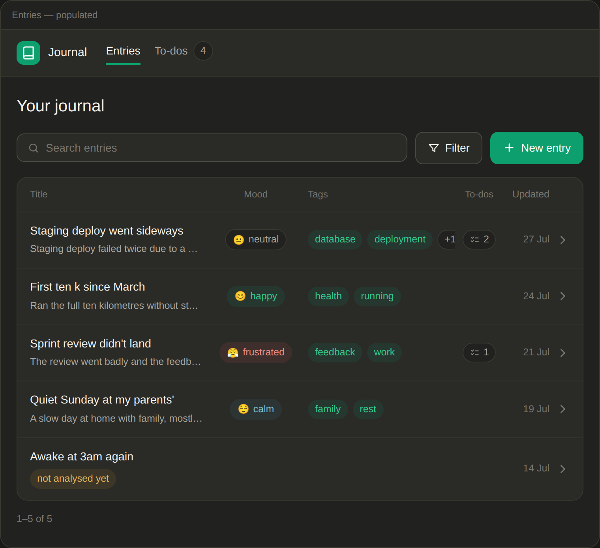
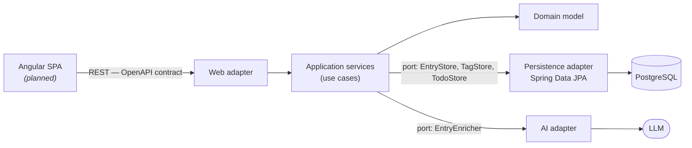

# Journal

A journaling web application in which every entry is analysed by an LLM: one call produces a one-sentence summary, tags, a mood and the to-dos mentioned in the entry. Entries can be searched and filtered by tag and mood, and all to-dos are collected in a single list.

Built as a portfolio project demonstrating architecture-first engineering: requirements, a designed API contract, a modelled architecture and database, documented architecture decisions, and a backend written test-first with its architecture enforced by tests.

<p>
  
  
  
  
</p>



<sub><i>Entries screen — UI design. See <a href="docs/design/screens">docs/design/screens</a> for the full set.</i></sub>

---

## Overview

A user writes journal entries with a title and content. When an entry is saved, the app analyses it in a single AI call and stores the result next to the entry:

| Output | Description |
|---|---|
| Summary | One sentence describing the entry. |
| Tags | Up to 10, shared across entries — `Work`, `work` and ` WORK ` are one tag. |
| Mood | One of six fixed moods, or none. |
| To-dos | Only what the entry explicitly states; nothing invented. |

Every AI-generated field can be edited, and the analysis can be re-generated. If the AI call fails, the entry is still saved and a previous analysis is never lost. The full functional and non-functional requirements are in [`docs/requirements`](docs/requirements/requirements.md).

Project 3 of the **Spring Persistence & Architecture Series**, after [Subscription Tracker](https://github.com/mikebg95/subscription-tracker) (JDBC, layered) and [Recipe Book](https://github.com/mikebg95/recipe-book) (JPA/Hibernate, layered). It is the first project in the series with an external dependency — the LLM — which is what drives the move to hexagonal architecture.

## Status

| Component | Status |
|---|---|
| Requirements, API contract, architecture, database, UI designs | Done |
| Domain model and application services (use cases, ports) | Built and tested |
| Persistence adapter (Spring Data JPA) | In progress |
| REST adapter (generated from the OpenAPI contract) | Planned |
| AI adapter (LLM analysis) | Planned |
| Frontend (Angular) | Designed — implementation planned |

## Architecture

**Hexagonal architecture (ports and adapters).** The domain and application layers define the ports they need — for example `EntryStore` and `EntryEnricher` — and adapters implement them. The LLM sits behind a port, so in tests it is replaced by a fast, deterministic fake, and the model or library can be swapped without touching business logic.



Key design decisions:

- **Rich domain objects** — `Entry`, `Tag`, `Todo` and `Enrichment` enforce their own canonical form and limits in their constructors, so an invalid one cannot be built; whether an analysis is missing or out of date is derived inside `Entry`. Orchestration (the AI call, find-or-create for tags) stays in the application services.
- **Optimistic locking** — concurrent edits of an entry are detected via a version column and surfaced as a conflict for the user to resolve.
- **Shared tags** — tags are normalised once in the domain and protected by database constraints; deleting an entry never deletes a tag another entry still uses.
- **Synchronous, gracefully degrading AI calls** — simpler than an event-driven design, and a failed analysis never blocks saving an entry.

Each decision is recorded as an ADR in [`docs/architecture/adr`](docs/architecture/adr), with the alternatives considered and rejected. [`architecture.md`](docs/architecture/architecture.md) walks through all seven architecture levels and compares them with P1 and P2. The C4 model is in [`docs/architecture/c4`](docs/architecture/c4).

## Testing

Written test-first: 79 hand-written tests.

- **Unit tests** for the domain model and the application services, with in-memory fakes for the outbound ports.
- **Integration tests** for the persistence adapter against a real PostgreSQL 18 (Testcontainers), never H2.
- **Architecture tests** (ArchUnit) that fail the build if the hexagonal boundaries are broken: the domain may only depend on itself and the JDK, the application layer only on the domain, JPA and Spring Data only in the persistence adapter, and no package cycles.

## Tech stack

| Layer | Technology |
|---|---|
| Frontend | Angular · TypeScript *(planned)* |
| Backend | Java 26 · Spring Boot 4.1 · Spring Framework 7 |
| Persistence | Spring Data JPA / Hibernate · PostgreSQL 18 · Flyway · MapStruct |
| API | OpenAPI 3.1 (design-first, code generated with `openapi-generator`) |
| Testing | JUnit · Mockito · AssertJ · Testcontainers · ArchUnit |
| Architecture & docs | C4 (Structurizr) · DBML · ADRs |

## Repository layout

| Path | Contents |
|---|---|
| [`backend/`](backend) | Spring Boot backend, structured as `domain`, `application` (ports and services) and `adapter` (in/out). |
| `frontend/` | Angular single-page application *(planned)*. |
| [`docs/`](docs) | Requirements, OpenAPI contract, architecture (C4, ADRs), database schema (DBML) and UI designs. |

## Getting started

Prerequisites: JDK 26 and Docker (for Testcontainers).

```bash
cd backend
./mvnw verify    # builds the project and runs all unit, integration and architecture tests
```

## Documentation

- **Requirements** — [`docs/requirements/requirements.md`](docs/requirements/requirements.md)
- **API contract** — [`docs/api/openapi.yaml`](docs/api/openapi.yaml)
- **Architecture** — [`docs/architecture/architecture.md`](docs/architecture/architecture.md) · [ADRs](docs/architecture/adr) · [C4 model](docs/architecture/c4)
- **Database** — [`docs/database`](docs/database) (schema, data contract, field validation)
- **UI designs** — [`docs/design`](docs/design)
